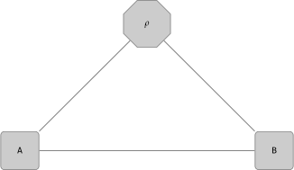

#  

# Qustop

NOTE: The `qustop` package is still is under development. 

qustop (QUantum STate OPtimizer) is a Python toolkit for studying various quantum state
optimization scenarios including calculating optimal values for quantum state distinguishability, 
quantum state exclusion, quantum state cloning, and more.

## Applications

The `qustop` package can be used to:

- Calculate optimal probabilities of distinguishing quantum states.  

- Optimize and approximate optimal values over positive, PPT, and separable measurements.

- Calculate optimal probabilities of optimally excluding quantum states.

## Installation

See the [installation guide](https://qustop.readthedocs.io/en/latest/getting_started.html).

## Usage

See the [documentation](https://toqito.readthedocs.io/en/latest/index.html) and 
[tutorials](https://qustop.readthedocs.io/en/latest/tutorials.html).

## Examples

For more examples, please consult `qustop/examples` as well as the `qustop`
[tutorial page](https://qustop.readthedocs.io/en/latest/tutorials.html).

### Quantum state distinguishability

Further examples on quantum state distinguishability can be found in the
`qustop/examples/opt_dist` directory.

Consider the following Bell states:

 

 

#### Distinguishing two orthogonal states

A result of [arXiv:0007098](https://arxiv.org/abs/quant-ph/0007098) states that
any two orthogonal pure states can be distinguished perfectly by LOCC
measurements. As the optimal probability of distinguishing via LOCC
measurements is a lower bound on positive, PPT, separable, etc., we should
expect to also see a value of `1` to indicate perfect probability of
distinguishing.

```python
from toqito.states import bell
from qustop import State, Ensemble, OptDist

dims = [2, 2]
states = [
    State(bell(0) * bell(0).conj().T, dims),
    State(bell(1) * bell(1).conj().T, dims)
]
probs = [1/2, 1/2]
ensemble = Ensemble(states, probs)

sep_res = OptDist(ensemble, "sep", "min-error")
sep_res.solve()

ppt_res = OptDist(ensemble, "ppt", "min-error")
ppt_res.solve()

pos_res = OptDist(ensemble, "pos", "min-error")
pos_res.solve()
```

Checking the respective values of the solved instances, we see that all of the
values are equal to one, which indicate that the two pure states are indeed
perfectly distinguishable.

```python
>>> print(pos_res.value)
0.9999999999384911
>>> print(ppt_res.value)
1.0000000047560667
>>> print(sep_res.value)
0.9999999995278338
```

#### Four indistinguishable orthogonal maximally entangled states

It was shown in [arXiv:1205.1031](https://arxiv.org/abs/1205.1031) and later
extended in [arXiv:1307.3232](https://arxiv.org/abs/1307.3232) that for the
following set of states

 

 

that the optimal probability of distinguishing via a PPT measurement should yield 7/8.


```python
import numpy as np

from toqito.states import bell
from qustop import State, Ensemble, OptDist

dims = [2, 2, 2, 2]
rho_0 = np.kron(bell(0), bell(0)) * np.kron(bell(0), bell(0)).conj().T
rho_1 = np.kron(bell(2), bell(1)) * np.kron(bell(2), bell(1)).conj().T
rho_2 = np.kron(bell(3), bell(1)) * np.kron(bell(3), bell(1)).conj().T
rho_3 = np.kron(bell(1), bell(1)) * np.kron(bell(1), bell(1)).conj().T

ensemble = Ensemble([
    State(rho_0, dims), State(rho_1, dims),
    State(rho_2, dims), State(rho_3, dims)
])

sd = OptDist(ensemble=ensemble,
             dist_measurement="ppt",
             dist_method="min-error")
sd.solve()
```

```python
# 7/8 \approx 0.875
>>> print(sd.value)
0.8749769201568257
```

#### Entanglement cost of discriminating Bell states

One may ask whether the ability to distinguish a state can be improved by
making use of an auxillary resource state.

,

for some &epsilon; in [0, 1].

It was shown in [arXiv:1408.6981](https://arxiv.org/abs/1408.6981) that the
probability of distinguishing four Bell states with a resource state via PPT
measurements or separable measurements is given by the closed-form expression

) 

XXX

```python
import numpy as np

from toqito.states import basis, bell
from qustop import State, Ensemble, OptDist


e_0, e_1 = basis(2, 0), basis(2, 1)

eps = 0.5
tau = np.sqrt((1 + eps) / 2) * np.kron(e_0, e_0) + np.sqrt((1 - eps) / 2) * np.kron(e_1, e_1)

dims = [2, 2, 2, 2]
states = [
    State(np.kron(bell(0), tau), dims),
    State(np.kron(bell(1), tau), dims),
    State(np.kron(bell(2), tau), dims),
    State(np.kron(bell(3), tau), dims),
]
probs = [1 / 4, 1 / 4, 1 / 4, 1 / 4]
ensemble = Ensemble(states, probs)
ensemble.swap([2, 3])

sep_res = OptDist(ensemble, "sep", "min-error")
sep_res.solve()

ppt_res = OptDist(ensemble, "ppt", "min-error")
ppt_res.solve()

eq = 1 / 2 * (1 + np.sqrt(1 - eps ** 2))
```

XXX

```python
>>> print(eq)
0.9330127018922193
>>> print(ppt_res.value)
0.933010488554166
>>> print(sep_res.value)
0.9330124607534689
```

It was also shown in [arXiv:1408.6981](https://arxiv.org/abs/1408.6981) that
the closed-form probability of distinguishing three Bell states with a resource
state using separable measurements to be given by the closed-form expression:

) 

XXX

```python
import numpy as np

from toqito.states import basis, bell
from qustop import State, Ensemble, OptDist


e_0, e_1 = basis(2, 0), basis(2, 1)

eps = 0.5
tau = np.sqrt((1 + eps) / 2) * np.kron(e_0, e_0) + np.sqrt((1 - eps) / 2) * np.kron(e_1, e_1)

dims = [2, 2, 2, 2]
states = [
    State(np.kron(bell(0), tau), dims),
    State(np.kron(bell(1), tau), dims),
    State(np.kron(bell(2), tau), dims),
]
probs = [1 / 3, 1 / 3, 1 / 3]
ensemble = Ensemble(states, probs)
ensemble.swap([2, 3])

sep_res = OptDist(ensemble, "sep", "min-error", level=2)
sep_res.solve()

eq = 1 / 3 * (2 + np.sqrt(1 - eps**2))
```

```python
>>> print(sep_res.value)
0.9583057987150858
>>> print(eq)
0.9553418012614794
```

Note that the value of `sep_res.value` is actually a bit higher than `eq`. This
is because the separable value is calculated by a hierarchy of SDPs. At low
levels of the SDP, the problem can often converge to the optimal value, but
other times it is necessary to compute higher levels of the SDP to eventually
arrive at the optimal value. While this is intractable in general, in practice,
the SDP can often converge or at least get fairly close to the optimal value
for small problem sizes.


### State exclusion

### State cloning

## License

[GNU GPL v.3.0.](https://github.com/vprusso/qustop/blob/master/LICENSE)
