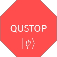

QUSTOP
======

:code:`qustop` (QUantum STate OPtimizer) is a Python package for investigating
various quantum state optimization scenarios including calculating optimal
values for quantum state distinguishability, quantum state exclusion, quantum
state cloning, and more.

.. image:: http://img.shields.io/travis/vprusso/toqito.svg?style=plastic
   :alt: Build Status
   :target: https://travis-ci.org/vprusso/qustop
.. image:: https://readthedocs.org/projects/qustop/badge/?version=latest&style=plastic
   :alt: Documentation
   :target: https://qustop.readthedocs.io/en/latest/
.. image:: https://codecov.io/gh/vprusso/qustop/branch/main/graph/badge.svg?style=plastic
   :alt: Codecov
   :target: https://codecov.io/gh/vprusso/qustop
.. image:: https://zenodo.org/badge/5595257.svg?style=plastic
   :alt: DOI
   :target: https://zenodo.org/badge/latestdoi/5595257

.. toctree::
    :maxdepth: 1
    :caption: Getting started

    getting_started
    intro_tutorial

.. toctree::
    :maxdepth: 1
    :caption: API

    api

.. toctree::
    :maxdepth: 1
    :caption: Examples

    tutorials.state_distinguishability
    tutorials.positive
    tutorials.ppt
    tutorials.separable
    tutorials.state_exclusion
    tutorials.state_cloning

.. toctree::
    :maxdepth: 1
    :caption: Research

    tutorials.open_problems
