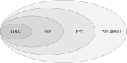
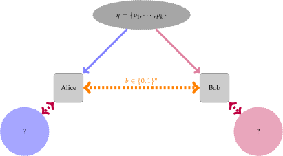

Introductory Tutorial
======================

This tutorial will illustrate the basics of how to use :code:`qustop`.

This is a user guide for :code:`qustop` and is not meant to serve as an
introduction to quantum information. For introductory material on quantum
information, please consult "Quantum Information and Quantum Computation" by
Nielsen and Chuang or the freely available lecture notes `"Introduction to
Quantum Computing"
<https://cs.uwaterloo.ca/~watrous/LectureNotes/CPSC519.Winter2006/all.pdf)>`_
by John Watrous.

More advanced tutorials can be found on the `tutorials page
<https://toqito.readthedocs.io/en/latest/tutorials.html>`_.

This tutorial assumes you have :code:`qustop` installed on your machine. If you
do not, please consult the `installation instructions
<https://qustop.readthedocs.io/en/latest/install.html>`_.

States, ensembles, and measurements
-----------------------------------

Quantum states, and collections of those quantum states that form ensembles, are the core
building blocks of :code:`qustop`.

States
^^^^^^

A *quantum state* is a density operator

.. math::
    \rho \in \text{D}(\mathbb{C}^d)

where :math:`\mathbb{C}^d` is a complex Euclidean space of dimension :math:`d` and where
:math:`\text{D}(\cdot)` represents the set of density matrices, that is, the set of matrices that
are positive semidefinite with trace equal to :math:`1`. We will typically represent complex
Euclidean spaces using the scripted capital letters :math:`\mathcal{A}, \mathcal{B}, \mathcal{X},
\mathcal{Y}`, etc.

Consider the density matrix corresponding to one of the four Bell states

.. math::
   \rho_0 = |\psi_0 \rangle \langle \psi_0 | = \frac{1}{2}
   \begin{pmatrix}
    1 & 0 & 0 & 1 \\
    0 & 0 & 0 & 0 \\
    0 & 0 & 0 & 0 \\
    1 & 0 & 0 & 1
   \end{pmatrix} \in \text{D}(\mathcal{A} \otimes \mathcal{B})

where

.. math::
    |\psi_0\rangle = 
   \frac{1}{\sqrt{2}} \left( |00 \rangle + |11 \rangle \right) \in 
   \mathcal{A} \otimes \mathcal{B}

such that :math:`\mathcal{A} = \mathbb{C}^2` and :math:`\mathcal{B} = \mathbb{C}^2`. We can use
:code:`qustop` to encode this state as follows.

.. code-block:: python

    import numpy as np
    from qustop import State

    # Define the |0> and |1> ket vectors.
    q_0 = np.array([[1, 0]]).T
    q_1 = np.array([[0, 1]]).T

    # Define the respective dimensions of each complex Euclidean space
    dims = [2, 2]

    # Define
    psi_0 = 1/np.sqrt(2) * np.kron(q_0, q_0) + 1/np.sqrt(2) * np.kron(q_1, q_1)

    #
    rho_0 = State(psi_0 * psi_0.conj().T, dims)

Printing the :code:`rho_0` variable gives some further information about the state.

.. code-block:: python

    >>> print(rho_0)
    State:
     dimensions = [2, 2],
     spaces = ℂ^2 ⊗ ℂ^2,
     labels = A_1 ⊗ B_2,
     shape = (4, 4),

For instance, we see the :code:`shape` attribute gives information about the size of the density
matrix of the state. There is also information about the subsystems...

We can use the :code:`value` property of any :code:`State` object to obtain the :code:`numpy` matrix
representation of the quantum state

.. code-block:: python

    >>> print(rho_0.value)
    [[0.5 0.  0.  0.5]
     [0.  0.  0.  0. ]
     [0.  0.  0.  0. ]
     [0.5 0.  0.  0.5]]

We can

TODO: Tensor product

Ensembles
^^^^^^^^^

An *ensemble* is a collection of :math:`N` quantum states defined over some complex Euclidean
space :math:`\mathcal{X}` as

.. math::
    \eta = \left\{(p_1, \rho_1), \ldots, (p_N, \rho_N) \right\},

where :math:`(p_1, \ldots, p_N)` is a vector of probability values and where :math:`\rho_1,
\ldots, \rho_N \in \text{D}(\mathcal{X})` are quantum states.

Recall the four two-qubit Bell states

.. math::
    \begin{equation}
        \begin{aligned}
            | \psi_0 \rangle = \frac{|00\rangle + |11\rangle}{\sqrt{2}}, &\quad
            | \psi_1 \rangle = \frac{|01\rangle + |10\rangle}{\sqrt{2}}, \\
            | \psi_2 \rangle = \frac{|01\rangle - |10\rangle}{\sqrt{2}}, &\quad
            | \psi_3 \rangle = \frac{|00\rangle - |11\rangle}{\sqrt{2}}.
        \end{aligned}
    \end{equation}

We can define the following ensemble consisting of the Bell states where the probability of
selecting any one state from the ensemble is equal to 1/4:

.. math::
    \begin{equation}
        \eta = \left\{
                \left(| \psi_0 \rangle, \frac{1}{4} \right),
                \left(| \psi_1 \rangle, \frac{1}{4} \right),
                \left(| \psi_2 \rangle, \frac{1}{4} \right),
                \left(| \psi_3 \rangle, \frac{1}{4} \right),
               \right\}
    \end{equation}

In :code:`qustop`, we would define this ensemble like so

.. code-block:: python

    from toqito.states import bell
    from qustop import State, Ensemble

    # Construct the corresponding density matrices of the Bell states.
    states = [
        State(bell(0) * bell(0).conj().T, dims=[2, 2]),
        State(bell(1) * bell(1).conj().T, dims=[2, 2]),
        State(bell(2) * bell(2).conj().T, dims=[2, 2]),
        State(bell(3) * bell(3).conj().T, dims=[2, 2])
    ]
    ensemble = Ensemble(states=states, probs=[1/4, 1/4, 1/4, 1/4])

Measurements
^^^^^^^^^^^^

A *measurement* is defined as a function

.. math::
    \mu : \Sigma \rightarrow \text{Pos}(\mathcal{X})

for some finite and nonempty set :math:`\Sigma` and some complex Euclidean space
:math:`\mathcal{X}` satisfying the constraint that

.. math::
    \sum_{a \in \Sigma} \mu(a) = \mathbb{I}_{\mathcal{X}}.

   The measurement inclusion diagram.

LOCC Measurements
^^^^^^^^^^^^^^^^^

Separable Measurements
^^^^^^^^^^^^^^^^^^^^^^^

PPT Measurements
^^^^^^^^^^^^^^^^

Positive (global) Measurements
^^^^^^^^^^^^^^^^^^^^^^^^^^^^^^

Optimal quantum state discrimination
------------------------------------

Given an ensemble of quantum states, we can consider the setting of *quantum state
discrimination*. This setting can be considered as an interaction between two parties--typically
denoted as *Alice* and *Bob*.

1. Alice possesses an ensemble of :math:`n` quantum states:

    .. math::
        \begin{equation}
            \eta = \left( (p_0, \rho_0), \ldots, (p_n, \rho_n)  \right),
        \end{equation}

where :math:`p_i` is the probability with which state :math:`\rho_i` is
selected from the ensemble. Alice picks :math:`\rho_i` with probability
:math:`p_i` from her ensemble and sends :math:`\rho_i` to Bob.

2. Bob receives :math:`\rho_i`. Both Alice and Bob are aware of how the
   ensemble is defined but he does *not* know what index :math:`i`
   corresponding to the state :math:`\rho_i` he receives from Alice is.

3. Bob wants to guess which of the states from the ensemble he was given. In
   order to do so, he may measure :math:`\rho_i` to guess the index :math:`i`
   for which the state in the ensemble corresponds.

This setting is depicted in the following figure.

   The quantum state distinguishability setting.

